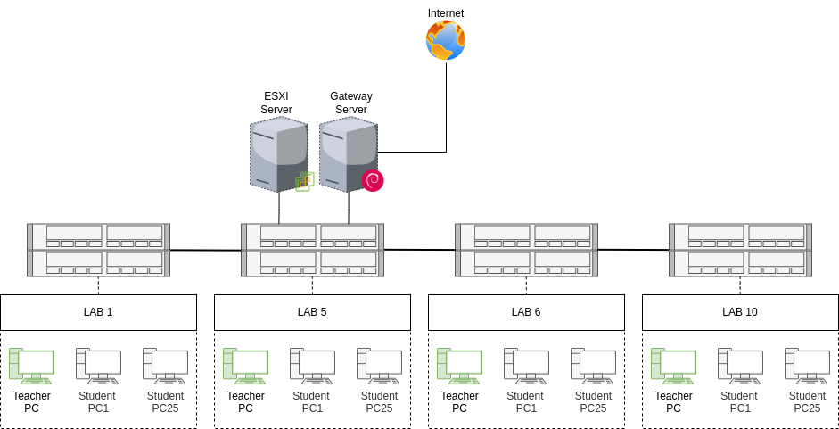

# Laboratory machines configuration

This repository contains Ansible playbook files, scripts and documentation for setting up laboratory machines of the
faculty of new technologies in [University of Constantine 2](https://www.univ-constantine2.dz). The goal is to connect
labs in the same network and offer an infrastructure that will be used later for deploying local services. The figure
bellow illustrates the topology that we set up.



In this README, you will find a brief description about `ntic-labs` project and also a documentation on how to set up
your environment to deploy and make use of the scripts and playbooks in this repository. Any comments and suggestions
are welcome.

If you want to reproduce the implemented topology, please follow this tutorial. make sure that you have a stable
internet connection on both your host and the machine(s) you want to set up. It is recommended to
have [Debian 11](https://debian.org) installed on your host machine.

## Generate automatic installation ISO

The distribution of choice is `Debian 11` on both machines and the gateway server, the installation process on
laboratory machines is completely automatic. To prepare the ISO file, you should use
the [FAI Project](https://fai-project.org) custom image builder. The purpose of using this tool is to automate the
installation process and provide common pre-downloaded packages (like OpenJDK) out of the box after installation.

The [FAI Image Builder](https://fai-project.org/FAIme/)  requires a list of packages to install, you can find a list for
the TTY version (no graphical interface) and the XFCE version under the `fai/` directory. Once the build is complete,
you will be notified by e-mail with the download link of the custom image ISO file. You may proceed with burning the
image on thumb drives. You can use `dd` command to perform the burning step :

```shell
sudo fdisk -l                                          # list connected devices
sudo dd if=fai.iso of=/dev/sdX status=progress bs=1M   # burn image on /dev/sdX device
```

## Install Ansible

In order to install `Ansible` on your machine you have to execute the command bellow, this guide assumes that you are
running Debian or a Debian-based GNU/Linux distribution such as Ubuntu. It is also recommended to install a
terminal-based text editor such as `vim`.

```shell
sudo apt install -y ansible sshpass vim
```

After the installation is completed, you can check Ansible version by typing the command below. If you are
running `Debian 11`, you
should have version `2.10.8` available on your system.

## Generate encrypted password

When you create a new user, you are able to specify the password in an encrypted format. In order to generate the
encrypted password from plain text, you need to have `Python` version 3 and `Bcrypt` library installed on your system.

```shell
sudo apt install -y python3 python3-bcrypt
```

After that, you have to run the helper script to generate the encrypted password :

```shell
$ python3 ./scripts/generate_pwd.py
```

You will be prompted to type the password and next to confirm it, if the two strings match you will get the
encrypted password.

```
Password: guest
Confirm: guest
$6$tKzqnzGe8soA9MBJ$LxRiSKU/UP.sC/Ozd/gzMUiWU/E0uV5tKnpvMQWswhxJ9iGyOOItOuZeOCr7IdEfTviHEt1gf7cdrJmzQ78tY/
```

## Generate SSH key

Administrators may need to access lab machines using `SSH`, it is better to use authentication with keys over
passwords. If you don't already have a key pair (public and private key), you can generate one by running the command
below. Replace the e-mail address with the admin address.

```shell
ssh-keygen -t ed25519 -C "admin@univ-constantine2.dz" -f ./ssh/id_ed25519
```

Password authentication over SSH is disabled, make sure to backup your private key on a thumb drive or print it on paper
(avoid saving your key on cloud storage).

If you want to generate more than one key pair for administrators, you can execute the previous command multiple times.
After that, you have to list all administrators public keys into `authorized_keys` located under `ssh/` directory.

```shell
cat ./ssh/id_ed25519.pub >> ./ssh/authorized_keys
```
